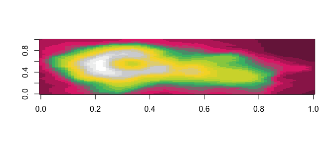

<!-- README.md is generated from README.Rmd. Please edit that file -->

# Drygate Brewery Color Palettes

<!--  -->

This is an R color palette of one of my favorite breweries: Drygate from
Glasgow, Scotland. Excellent in both taste and labels.

Credits go to Karthik Ram and his [Wes Anderson color palette
package](https://github.com/karthik/wesanderson) for the code.

## Installation

``` r
install.packages("")
```

**The development version**

``` r
devtools::install_github("MAClaassen/drygatebrewer")
```

## Usage

``` r
library("drygatebrewer")
# See all palettes
names(drygate_palettes)
#> [1] "DiscoForkliftTruck" "TakeMeTotheRiver"   "CrossingtheRubicon"
```

## Palettes

### DiscoForkliftTruck

``` r
drygate_palette("DiscoForkliftTruck")
```


### Take Me To the River

``` r
drygate_palette("TakeMeTotheRiver")
```


### Crossing the Rubicon

``` r
drygate_palette("CrossingtheRubicon")
```


``` r
library("ggplot2")
ggplot(mtcars, aes(factor(cyl), fill=factor(vs))) +  geom_bar() +
  scale_fill_manual(values = drygate_palette("DiscoForkliftTruck"))
```


``` r

# pick specific colors
pal <- drygate_palettes$DiscoForkliftTruck
ggplot(mtcars, aes(factor(cyl), fill=factor(vs))) +  geom_bar() +
  scale_fill_manual(values = pal[c(3,5)])
```


``` r
pal <- drygate_palette("TakeMeTotheRiver", 21, type = "continuous")
image(volcano, col = pal)
```



``` r
# pal <- drygate_palette("TakeMeTotheRiver", 100, type = "continuous")
# # heatmap is a local dataset
# ggplot(heatmap, aes(x = X2, y = X1, fill = value)) +
#   geom_tile() + 
#   scale_fill_gradientn(colours = pal) + 
#   scale_x_discrete(expand = c(0, 0)) +
#   scale_y_discrete(expand = c(0, 0)) + 
#   coord_equal() 
```
